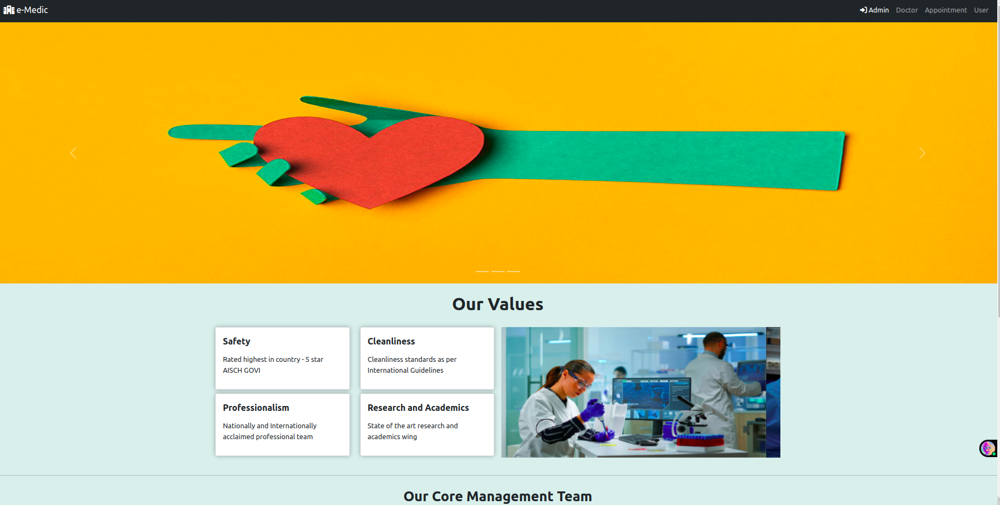
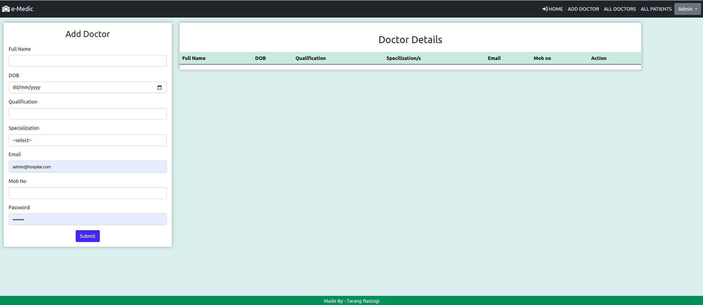
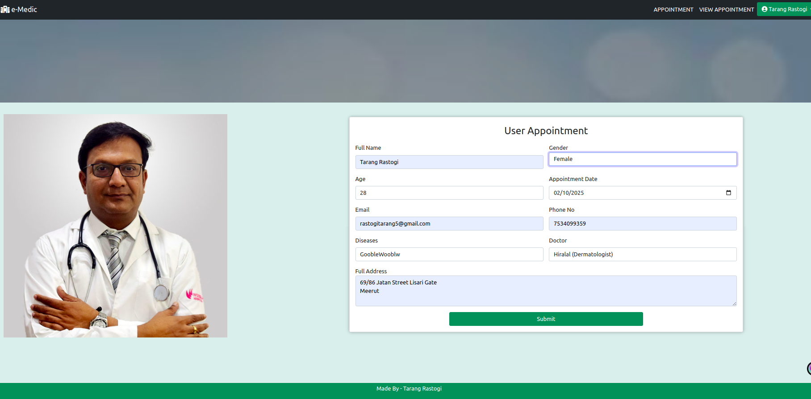
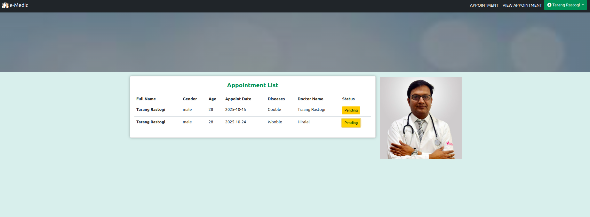
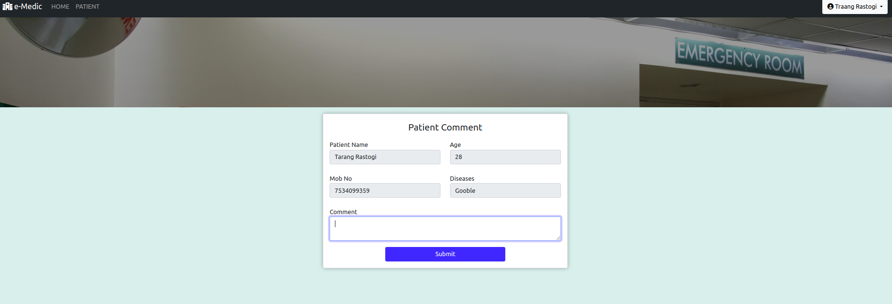
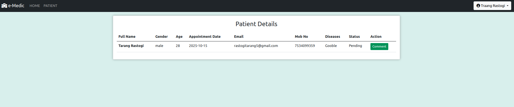

# Hospital Management System

A full-stack J2EE Hospital Management Application that handles hospital operations, appointments, and user management.

## Technology Stack

### Backend
- Java (J2EE)
  - JSP (JavaServer Pages)
  - Servlets
  - JDBC
- MySQL Database

### Frontend
- HTML5 
- CSS3
- JavaScript
- Bootstrap

### Development Tools
- IDE: Eclipse
- Database: MySQL Workbench
- Build Tool: Maven
- Server: Apache Tomcat

## Prerequisites

- JDK 8 or higher
- Maven 3.x
- MySQL 8.x
- Tomcat 8.x or higher

## Database Setup

1. Login to MySQL:
```sql
mysql -u root -p
```

2. Create Database and User:
```sql
CREATE DATABASE hospitaldb;
CREATE USER 'hospital_admin'@'localhost' IDENTIFIED BY 'Hospital@123';
GRANT ALL PRIVILEGES ON hospitaldb.* TO 'hospital_admin'@'localhost';
FLUSH PRIVILEGES;
```

3. Create Tables:
```sql
USE hospitaldb;

-- Admin table
CREATE TABLE admin (
    id INT PRIMARY KEY AUTO_INCREMENT,
    email VARCHAR(255),
    password VARCHAR(255)
);

-- User/Patient table
CREATE TABLE user_dtls (
    id INT PRIMARY KEY AUTO_INCREMENT,
    full_name VARCHAR(255),
    email VARCHAR(255),
    password VARCHAR(255)
);

-- Doctor table
CREATE TABLE doctor (
    id INT PRIMARY KEY AUTO_INCREMENT,
    full_name VARCHAR(255),
    dob VARCHAR(255),
    qualification VARCHAR(255),
    specialist VARCHAR(255),
    email VARCHAR(255),
    mobno VARCHAR(255),
    password VARCHAR(255)
);

-- Specialist table
CREATE TABLE specialist (
    id INT PRIMARY KEY AUTO_INCREMENT,
    spec_name VARCHAR(255)
);

-- Appointment table
USE hospitaldb;

-- Drop and recreate appointment table with correct column names
DROP TABLE IF EXISTS appointment;
CREATE TABLE appointment (
    id INT PRIMARY KEY AUTO_INCREMENT,
    user_id INT,
    fullname VARCHAR(255),    -- Changed from full_name to fullname
    gender VARCHAR(50),
    age VARCHAR(10),
    appoint_date VARCHAR(100),
    email VARCHAR(255),
    phno VARCHAR(20),
    diseases VARCHAR(255),
    doctor_id INT,
    address VARCHAR(500),
    status VARCHAR(50),
    FOREIGN KEY (user_id) REFERENCES user_dtls(id),
    FOREIGN KEY (doctor_id) REFERENCES doctor(id)
);

-- Insert default admin user
INSERT INTO admin(email, password) VALUES('admin@hospital.com', 'admin123');
```

## Project Setup

1. Clone the repository:
```bash
git clone <repository-url>
cd Hospital-App
```

2. Import project in Eclipse/VS Code as Maven project

3. Update database configuration in `src/main/java/com/db/DbConnect.java`:
```java
conn = DriverManager.getConnection(
    "jdbc:mysql://localhost:3306/hospitaldb", 
    "hospital_admin", 
    "Hospital@123"
);
```

4. Build the project:
```bash
mvn clean install
```

5. Run using Tomcat:
```bash
mvn tomcat7:run
```

6. Access the application:
```
http://localhost:8080/Hospital_Management
```

## Default Credentials

### Admin Login
- URL: `/admin_login.jsp`
- Email: admin@hospital
- Password: admin123

### Doctor Login
- URL: `/doctor_login.jsp`
- Create doctor account through admin panel

### Patient Login
- URL: `/user_login.jsp`
- Register new patient account


## Features

### User Management
- Multi-user authentication system (Admin, Doctor, Patient)
- User registration and login/logout functionality
- Profile management and password updates
- Role-based access control

### Appointment System
- Book appointments with doctors
- View and manage appointment schedules
- Doctor availability tracking

### Admin Dashboard
- Doctor profile management (CRUD operations)
- View and manage appointments
- User management capabilities

### Doctor Features
- View assigned appointments
- Manage availability
- Update profile information

### Patient Features
- Book appointments
- View appointment history
- Update personal information

## Screenshots

### Homepage



### Add Docter


### Added Doctors


## Create Appointment For Valid user


## View Appointment


## Doctor can see patient status and update 




## Installation

1. Clone the repository
```bash
git clone https://github.com/yourusername/Hospital-App.git
```

2. Import the project in Eclipse as a Maven project

3. Update Maven dependencies
```bash
mvn clean install
```

4. Configure MySQL database connection

5. Deploy the application on Tomcat server

## Database Setup (loacl)

1. Install MySQL Workbench
2. Create a new database
3. Configure the database connection properties in the application

## Contributing

Pull requests are welcome. For major changes, please open an issue first to discuss what you would like to change.

